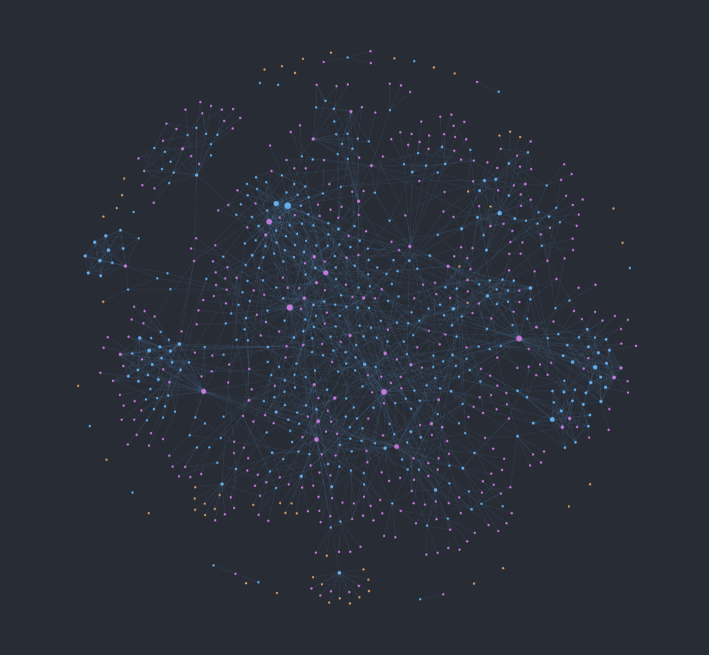
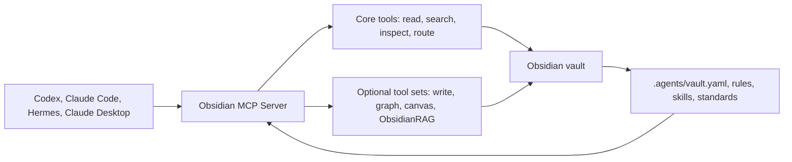

# Obsidian MCP Server

[](https://opensource.org/licenses/MIT)
[](https://www.python.org/downloads/)
<br>
[](https://modelcontextprotocol.io/)
[](https://obsidian.md/)
[](https://claude.ai/)
[](https://openai.com/codex/)
[](https://github.com/Vasallo94/obsidian-mcp-server/blob/main/docs/agent-folder-setup.md)

An **MCP (Model Context Protocol)** server that lets AI agents work inside an Obsidian vault: read notes, search context, inspect links, follow vault-specific rules, and optionally create or edit notes safely.

It is designed for clients and harnesses such as **Codex**, **Claude Code**, **Hermes**, and **Claude Desktop**. The core stays reusable; each vault can layer its own profiles, rules, skills, and optional tool sets on top.

> Tools are generic. Behavior comes from the vault.





---

## Features

### Public Core

The core tool set is always available and stays vault-agnostic:

- Vault diagnostics, task routing, and MCP client root inspection.
- Note listing, reading, metadata inspection, and search.
- Vault context resources for profiles, skills, standards, and local docs.
- Core prompts for structured notes, template usage, and context exploration.

### Optional Tool Sets

Optional packs are enabled explicitly from `.agents/vault.yaml` or
`OBSIDIAN_MCP_TOOL_SETS`:

- **`notes_write`**: Create, patch, move, and delete notes.
- **`vault_analysis`**: Vault statistics, tags, links, backlinks, and graph tools.
- **`agents_admin`**: Skill creation, validation, and cache management.
- **`youtube`**: Transcript extraction.
- **`obsidianrag`**: Semantic search through the external ObsidianRAG service.
- **`canvas` / `kanvas`**: Canvas and workflow helpers.
- **Profile packs**: Personal workflows only when a vault profile opts in.

### Design Principles

- **Public core, personal profiles**: The repository remains reusable; local workflows live in vault configuration and resources.
- **English technical surface**: Tool names, prompt names, docs, and code identifiers are English.
- **Safe by default**: Write tools are opt-in, protected paths are blocked, and large reads are capped.
- **External RAG by integration**: Advanced semantic search delegates to ObsidianRAG instead of duplicating a RAG stack inside the MCP server.

## Quick Start

### Prerequisites

- [uv](https://github.com/astral-sh/uv)
- An Obsidian vault path you are comfortable exposing to an MCP client

### Beta install from Git

Until the package is published to PyPI, install directly from GitHub with
`uvx`:

```bash
uvx --from git+https://github.com/Vasallo94/obsidian-mcp-server.git obsidian-mcp-server
```

For Codex, add this to `~/.codex/config.toml`:

```toml
[mcp_servers.obsidian]
command = "uvx"
args = [
  "--from",
  "git+https://github.com/Vasallo94/obsidian-mcp-server.git",
  "obsidian-mcp-server",
]
startup_timeout_sec = 30
tool_timeout_sec = 120

[mcp_servers.obsidian.env]
OBSIDIAN_VAULT_PATH = "/absolute/path/to/your/vault"
```

For Claude Code, Hermes, Claude Desktop, and MCPB setup, see
[Installation](docs/installation.md).

### Local development

```bash
git clone https://github.com/Vasallo94/obsidian-mcp-server.git
cd obsidian-mcp-server
make install
cp .env.example .env
# Set OBSIDIAN_VAULT_PATH to the absolute path to your Obsidian vault
uv run obsidian-mcp-server
```

Once the package is published to PyPI, client configs can use:

```bash
uvx obsidian-mcp-server
```

---

## Usage

### Optional Tool Sets

Enable optional tools from the client environment:

```json
{
  "env": {
    "OBSIDIAN_VAULT_PATH": "/Absolute/Path/To/Your/Vault",
    "OBSIDIAN_MCP_TOOL_SETS": "notes_write,vault_analysis,obsidianrag"
  }
}
```

Or declare them in your vault profile:

```yaml
profile:
  name: "my_profile"
  prompt_sets:
    - "mermaid"
  tool_sets:
    - "notes_write"
    - "vault_analysis"
  standards:
    media: "Standards/Media.md"
  local_docs:
    index: "README.md"
```

### ObsidianRAG Integration

For semantic vault search, enable the `obsidianrag` tool set and declare the
integration:

```yaml
profile:
  tool_sets:
    - "obsidianrag"
  integrations:
    obsidianrag:
      project_path: "/path/to/ObsidianRAG"
      api_url: "http://127.0.0.1:8000"
      env:
        OBSIDIANRAG_LLM_MODEL: "gemma3"
        OBSIDIANRAG_OLLAMA_EMBEDDING_MODEL: "embeddinggemma"
```

Then read `obsidian://integrations/obsidianrag/setup` or call
`rag.setup_status`. Agents should show setup commands before installing
dependencies, starting services, pulling models, or rebuilding the index.

## Technical Documentation

To dive deeper into how the server works and how to customize it, check our detailed guides located in the `docs/` folder:

1. [Documentation Home](docs/index.md): Wiki-style map of the project docs.
2. [Installation](docs/installation.md): Setup for Codex, Claude Code, Hermes, Claude Desktop, and MCPB.
3. [Architecture](docs/architecture.md): Runtime architecture, tool sets, resources, prompts, and security model.
4. [Tool Reference](docs/tool-reference.md): Complete list of public MCP tools.
5. [Server Configuration](docs/configuration.md): Environment variables, vault profiles, tool sets, and integrations.
6. [Agent Setup](docs/agent-folder-setup.md): How to organize your vault (`.agents/`) with skills and contextual rules.
7. [Semantic Search](docs/semantic-search.md): ObsidianRAG integration and legacy RAG migration notes.
8. [Agent Feedback](docs/agent-feedback.md): How agents can report MCP friction with AFP out-of-band.
9. [Future Roadmap](docs/FUTURE.md): Planned improvements and next steps for the server.

For contribution, release, and security process, see
[CONTRIBUTING.md](CONTRIBUTING.md), [SECURITY.md](SECURITY.md), and
[Release Checklist](docs/release-checklist.md).

---

## Development & Quality

| Command | Description |
| :--- | :--- |
| `make test` | Run the test suite (pytest) |
| `make lint` | Run static checks (Ruff + Pyright) |
| `make format` | Automatically format code |
| `make dev` | Run the MCP server locally |

---

## License

This project is licensed under the MIT License.
