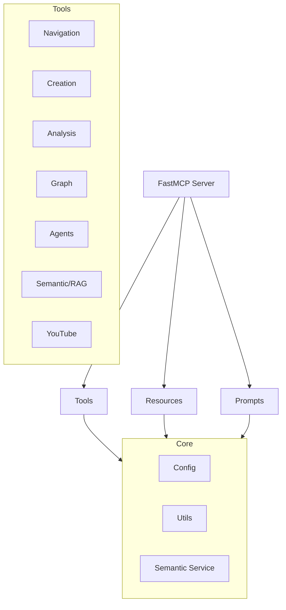

# 🏛️ Arquitectura del Proyecto

El servidor **Obsidian MCP** está diseñado bajo una arquitectura modular y extensible, utilizando el framework `FastMCP` para facilitar la creación de herramientas, recursos y prompts.

## Estructura de Capas

El proyecto se organiza en las siguientes capas lógicas:

### 1. Servidor (`server.py`)
Es el punto de entrada principal. Se encarga de:
- Validar la configuración del vault.
- Instanciar `FastMCP`.
- Orquestar el registro de todos los módulos de herramientas, recursos y prompts.

### 2. Módulos de Herramientas (`obsidian_mcp/tools/`)
Cada dominio funcional tiene su propio archivo, lo que facilita el mantenimiento:
- **`navigation.py`**: Operaciones básicas de lectura y búsqueda.
- **`creation.py`**: Lógica de escritura, plantillas y gestión de archivos.
- **`analysis.py`**: Auditoría de metadatos y etiquetas.
- **`graph.py`**: Navegación por las conexiones entre notas.
- **`agents.py`**: Puente hacia las personalidades personalizadas almacenadas en el vault.
- **`semantic.py`**: Integración con el motor de búsqueda vectorial.
- **`youtube.py`**: Utilidad externa para transcripciones.

### 3. Servicio Semántico (`obsidian_mcp/semantic/`)
Este es un componente opcional (requiere dependencias extras) que gestiona:
- **Indexación**: Conversión de notas en embeddings y almacenamiento en `ChromaDB`.
- **RAG**: Pipeline de recuperación de información basado en similitud de coseno.
- **Metadatos**: Tracking de cambios para actualizaciones parciales del índice.

### 4. Utilidades y Configuración (`obsidian_mcp/utils/` y `config.py`)
- **`config.py`**: Gestión centralizada de variables de entorno mediante `python-dotenv`.
- **`utils/`**: Funciones compartidas para manejo de strings, extracción de etiquetas y búsqueda de archivos.

## Flujo de una Petición MCP

1. El cliente (ej: Claude Desktop) envía una solicitud de herramienta.
2. `FastMCP` intercepta la llamada y la dirige a la función registrada.
3. El servidor valida que el acceso al vault sea seguro (dentro de los límites configurados).
4. La herramienta interactúa con el sistema de archivos o el servicio semántico.
5. Se devuelve una respuesta formateada al cliente.
