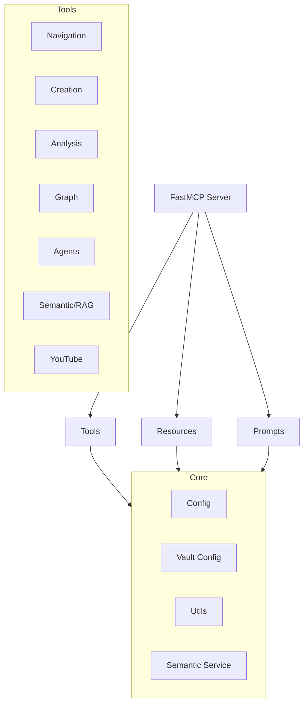

# Project Architecture

The **Obsidian MCP server** is designed with a modular and extensible architecture, utilizing the `FastMCP` framework to simplify compiling tools, resources, and prompts.

## Layer Structure

The project is organized into the following logical layers:

### 1. Server (`server.py`)
This is the main entry point. It handles:
- Validating your vault's path and configuration.
- Instantiating the `FastMCP` server.
- Orchestrating the registration of all tool modules, resources, and prompts.

### 2. Tool Modules (`obsidian_mcp/tools/`)
Each functional domain is grouped logically into its own file, ensuring easy maintenance and scalability:
- **`navigation.py`**: Basic file reading, advanced codebase searching (ripgrep), and directory exploration.
- **`creation.py`**: Writing notes, handling dynamic templates, section appendices, and content creation bounds.
- **`analysis.py`**: Vault metadata auditing, taxonomy checking, and tag synchronization.
- **`graph.py`**: Traversing note connections (backlinks, orphans, graph relationships).
- **`agents.py`**: Reading custom skills (roles) from `{vault}/.agents/skills/` and global rules from `{vault}/.agents/REGLAS_GLOBALES.md` (these settings live seamlessly inside the vault, not the MCP server repo).
- **`semantic.py`**: Connecting with the vector search engine.
- **`youtube.py`**: External utility for fast fetching of video transcripts.

### 3. Semantic Service (`obsidian_mcp/semantic/`)
This is an optional component (requires the `[rag]` extra dependencies) that manages:
- **Indexing**: Converting existing text notes into vectors and storing them via `ChromaDB`.
- **RAG (Retrieval-Augmented Generation)**: Returning context from the vault based on query cosine similarity.
- **Metadata Management**: Differential tracking to allow partial index updates when notes change over time.

### 4. Utilities & Config (`obsidian_mcp/utils/` and config files)
- **`config.py`**: Centralized management of `.env` environment variables using `python-dotenv`.
- **`vault_config.py`**: Auto-detection logic for vault structure mapping and optional `.agents/vault.yaml` overrides.
- **`utils/`**: Safe file extraction and manipulation helpers, logging configurations, string handlers, formatting, and secure sub-process interactions.

## MCP Request Lifecycle

1. The client (e.g., Claude Desktop, Cursor) issues a tool request with payload parameters.
2. `FastMCP` intercepts the call, routing it to the registered handling function.
3. The server validates that access to the specified paths in the vault is secure (preventing directory traversal outside the configured environment/ignoring `.forbidden_paths`).
4. The tool interacts directly with the local file system or an active semantic service instance.
5. An appropriately logged, JSON/Markdown formatted response is returned to the client logic unit.
