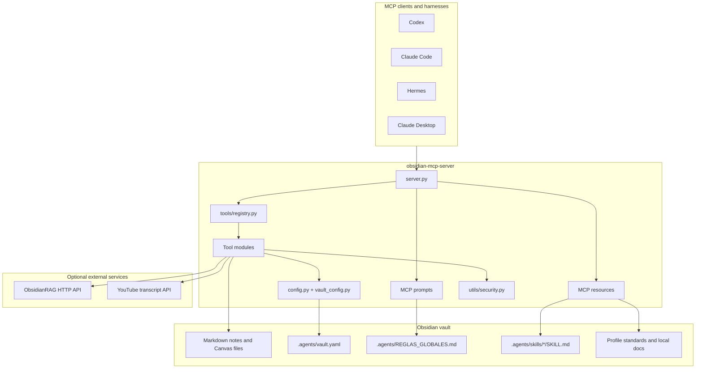

# Architecture

Obsidian MCP Server is built around one rule:

> The repository provides generic tools. The vault provides behavior.

The server stays reusable by default. Vault-specific workflows live in
`.agents/vault.yaml`, global rules, skills, standards, and local docs inside the
user's Obsidian vault.

## Runtime overview


```mermaid
flowchart TB
    subgraph Clients["MCP clients and harnesses"]
        Codex["Codex"]
        ClaudeCode["Claude Code"]
        Hermes["Hermes"]
        Desktop["Claude Desktop"]
    end

    subgraph Server["obsidian-mcp-server"]
        Entry["server.py"]
        Registry["tools/registry.py"]
        Tools["Tool modules"]
        Resources["MCP resources"]
        Prompts["MCP prompts"]
        Config["config.py + vault_config.py"]
        Security["utils/security.py"]
    end

    subgraph Vault["Obsidian vault"]
        Notes["Markdown notes and Canvas files"]
        Agents[".agents/vault.yaml"]
        Rules[".agents/REGLAS_GLOBALES.md"]
        Skills[".agents/skills/*/SKILL.md"]
        Standards["Profile standards and local docs"]
    end

    subgraph External["Optional external services"]
        ObsidianRAG["ObsidianRAG HTTP API"]
        YouTube["YouTube transcript API"]
    end

    Clients --> Entry
    Entry --> Registry
    Entry --> Resources
    Entry --> Prompts
    Registry --> Tools
    Tools --> Security
    Tools --> Config
    Config --> Agents
    Tools --> Notes
    Resources --> Skills
    Resources --> Standards
    Prompts --> Rules
    Tools --> ObsidianRAG
    Tools --> YouTube
```

## Main entry point

`obsidian_mcp/server.py` creates the `FastMCP` server and registers:

- tool modules from `obsidian_mcp/tools/` and `obsidian_mcp/canvas/`;
- read-only resources from `obsidian_mcp/resources/`;
- reusable prompts from `obsidian_mcp/prompts/`.

The server uses stdio by default, so all operational logging must go to stderr.
Stdout is reserved for the MCP protocol.

## Tool registration

Public tool names are centralized in `obsidian_mcp/tools/registry.py`.

Each tool has:

- a stable public name such as `notes.read` or `vault.health`;
- a title shown by MCP clients;
- a tool set such as `core`, `notes_write`, `vault_analysis`, or `obsidianrag`;
- read-only and idempotence annotations where relevant.

Tool modules call `register_tool(mcp, "tool.name")`. The registry registers the
tool only when its tool set is enabled.

## Tool sets

The `core` tool set is always enabled. Optional tool sets are enabled by either:

- `OBSIDIAN_MCP_TOOL_SETS=notes_write,vault_analysis`; or
- `.agents/vault.yaml` under `profile.tool_sets`.

Available tool sets:

| Tool set | Purpose |
|---|---|
| `core` | Health, diagnostics, context, routing, read/search, templates, skills, rules |
| `notes_write` | Create, append, patch, replace, move, rename, delete notes |
| `vault_analysis` | Stats, tags, backlinks, broken links, linting, graph analysis |
| `agents_admin` | Skill generation/sync and global-rule registration |
| `obsidianrag` | Semantic search through the external ObsidianRAG API |
| `canvas` | Obsidian Canvas CRUD and graph operations |
| `kanvas` | Canvas-based task workflow operations |
| `youtube` | Transcript extraction |
| `legacy_semantic` | Deprecated in-process semantic tools |
| Profile-specific packs | Local workflows enabled only by a vault profile |

## Resources

Resources provide read-only context to agents:

- `obsidian://vault_info`
- `obsidian://capabilities`
- `obsidian://profile`
- `obsidian://skills/list`
- `obsidian://skills/catalog`
- `obsidian://skills/{name}`
- `obsidian://standards/{name}`
- `obsidian://local_docs/{name}`
- `obsidian://docs/agent-quickstart`
- `obsidian://integrations/obsidianrag/setup`
- `obsidian://integrations/obsidianrag/config`

Resources are intentionally safe summaries or declared files from the vault
profile. Agents should prefer resources over guessing local conventions.

## Prompts

Core prompts are always registered:

- `assistant_overview`
- `create_structured_note`
- `use_vault_template`
- `explore_vault_context`

Prompt packs and profile prompts are registered when the active vault declares
them. Examples include Mermaid helpers, media workflows, runbook writing, daily
review, weekly review, repository documentation, and changelog prompts.

## Vault configuration

`obsidian_mcp/vault_config.py` loads optional vault configuration from:

```text
<vault>/.agents/vault.yaml
```

Configuration can declare:

- template folder overrides;
- private paths and exclusion patterns;
- tool sets and prompt sets;
- profile standards and local docs;
- integrations such as ObsidianRAG.

If no `.agents/vault.yaml` exists, the server still works with the core tool set
and auto-detected templates.

## Security model

All file access should flow through path validation helpers in
`obsidian_mcp/utils/security.py` and vault utilities in `obsidian_mcp/utils/`.

Security controls include:

- vault-relative path validation;
- directory traversal prevention;
- `.forbidden_paths`;
- private paths from `.agents/vault.yaml`;
- output-size limits for large reads;
- write tools disabled unless `notes_write` or another write-capable pack is
  explicitly enabled.

## Semantic search

The recommended semantic path is `obsidianrag`, which calls an external
ObsidianRAG service over loopback HTTP.

The old in-process semantic stack remains behind `legacy_semantic` for backward
compatibility. It is deprecated because it pulls ChromaDB, LangChain,
sentence-transformers, and PyTorch into the MCP server process.

See [Semantic search](semantic-search.md).

## Request lifecycle

1. The MCP client calls a public tool such as `notes.read`.
2. FastMCP routes the call to the registered function.
3. Pydantic and tool logic validate arguments.
4. Security helpers validate vault-relative paths.
5. The tool reads/writes the vault or calls an optional local integration.
6. The result is returned as Markdown or structured JSON suitable for an agent.
