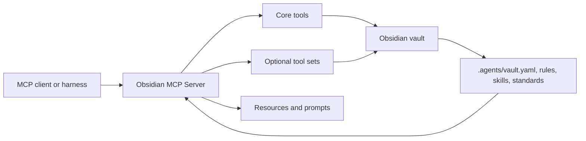

# Documentation

Obsidian MCP Server is a vault-native MCP server for agents. It exposes a safe
core by default, then lets each vault opt into write tools, analysis, canvas,
workflow, ObsidianRAG, and profile-specific behavior.

Use this page as the wiki home.

## Start here

| Goal | Read |
|---|---|
| Install in Codex, Claude Code, Hermes, or Claude Desktop | [Installation](installation.md) |
| Configure environment variables, tool sets, and profiles | [Configuration](configuration.md) |
| Understand the `.agents/` vault folder | [Agent folder setup](agent-folder-setup.md) |
| See every public MCP tool | [Tool reference](tool-reference.md) |
| Orient an AI agent before it starts using the server | [Agent quickstart](agent-quickstart.md) |
| Understand architecture and extension points | [Architecture](architecture.md) |
| Configure semantic search through ObsidianRAG | [Semantic search](semantic-search.md) |
| Troubleshoot common setup failures | [Troubleshooting](troubleshooting.md) |

## Mental model

The repository provides generic tools. The vault provides behavior:

- `.agents/vault.yaml` declares optional tool sets, prompt sets, standards, and
  integrations.
- `.agents/REGLAS_GLOBALES.md` defines global instructions and validation rules.
- `.agents/skills/<name>/SKILL.md` defines reusable agent roles.
- Vault standards and local docs can be exposed as MCP resources.

## Tool sets

The server always exposes the `core` tool set. Everything else is opt-in.

| Tool set | Purpose |
|---|---|
| `core` | Health, routing, context, read/search tools, templates, skills, rules |
| `notes_write` | Create, append, patch, replace, move, rename, delete notes |
| `vault_analysis` | Stats, tags, links, backlinks, local graph, linting |
| `agents_admin` | Create/sync/suggest skills and add global rules |
| `obsidianrag` | Semantic search through the external ObsidianRAG service |
| `canvas` | Obsidian Canvas CRUD and graph editing |
| `kanvas` | Canvas-based task/workflow boards |
| `youtube` | YouTube transcript extraction |
| `legacy_semantic` | Deprecated in-process semantic search |
| Profile-specific packs | Local workflows enabled only by a profile |

## Public beta notes

- The project is public beta. Prefer explicit tool sets and conservative write
  access while testing.
- Do not share private vault content in issues. Redact paths, note text, and
  personal metadata.
- For user feedback, use the GitHub issue templates for bugs, installation help,
  or beta feedback.
