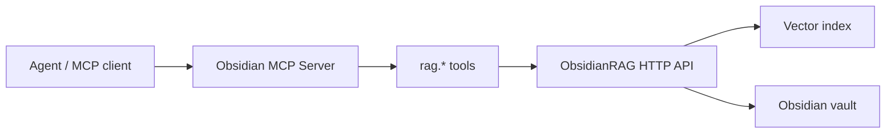

# Semantic Search

Semantic search is supported through the `obsidianrag` tool set.

The recommended architecture is:



## Recommended path: ObsidianRAG

Enable the `obsidianrag` tool set and declare the local integration in
`.agents/vault.yaml`:

```yaml
profile:
  tool_sets:
    - "obsidianrag"
  integrations:
    obsidianrag:
      project_path: "/path/to/ObsidianRAG"
      api_url: "http://127.0.0.1:8000"
      env:
        OBSIDIANRAG_LLM_MODEL: "gemma3"
        OBSIDIANRAG_OLLAMA_EMBEDDING_MODEL: "embeddinggemma"
```

Available tools:

| Tool | Purpose |
|---|---|
| `rag.setup_status()` | Diagnose project path, uv, Ollama, backend, and API health |
| `rag.health()` | Check whether the ObsidianRAG API is reachable |
| `rag.ask(question, session_id)` | Ask a semantic question over the vault |
| `rag.rebuild_index()` | Trigger a rebuild through the ObsidianRAG backend |

Useful resources:

- `obsidian://integrations/obsidianrag/setup`
- `obsidian://integrations/obsidianrag/config`

Agents should show setup commands and ask for consent before:

- installing dependencies;
- pulling local models;
- starting services;
- rebuilding a large index.

## Why the RAG stack is external

The MCP server should remain small, fast, and easy to install. Keeping advanced
RAG in ObsidianRAG avoids bundling a second vector database, embedding stack,
retriever stack, and model runtime into every MCP installation.

This separation also makes the failure modes cleaner:

- MCP install problems stay in the MCP server.
- Indexing/model problems stay in ObsidianRAG.
- Agents can diagnose the boundary with `rag.setup_status()` and `rag.health()`.

## Legacy semantic tools

The `legacy_semantic` tool set still exists for backward compatibility:

- `semantic.index`
- `semantic.search`
- `semantic.suggest_connections`

It is disabled by default and deprecated for new deployments. It requires the
optional `[rag]` dependency extra and loads ChromaDB, LangChain, sentence
transformers, and PyTorch inside the MCP server process.

Prefer `obsidianrag` unless you are maintaining an older local setup.
